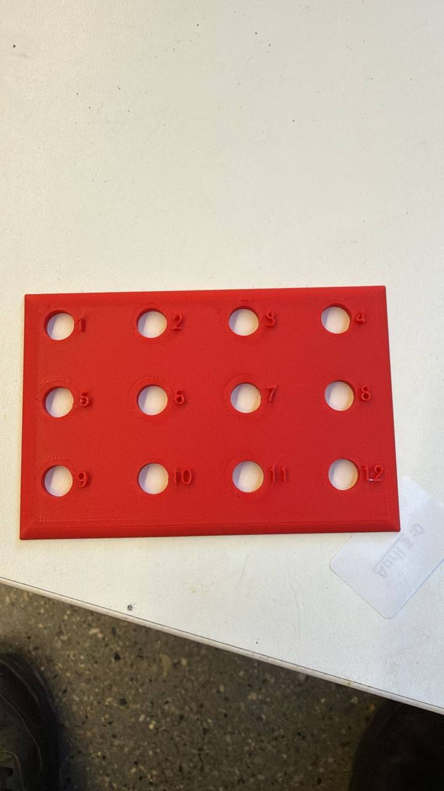

# RotaGuide

**A 3D-printed injection guide and a local-first tracker for insulin injection-site rotation.**

BMEN 668 capstone · University of Calgary · Feb–Apr 2026

[Live app](https://app-rotaguide.vercel.app) · [Project site](https://rotaguide.vercel.app) · [The original v1](https://rotaguide.vercel.app/v1/)

> **Not a medical device.** This is a student engineering prototype from a university course. It has not been evaluated by any regulator and does not provide medical advice.

---

## The problem

**38%** of insulin-treated patients develop **lipohypertrophy** — thickened subcutaneous tissue caused by repeatedly injecting into the same area. Insulin absorbs unpredictably from affected tissue, which is associated with a **+0.55% higher HbA1c** and a raised hypoglycaemia risk.

The strongest modifiable cause is failing to rotate injection sites: a pooled **odds ratio of ≈8.85**.

Existing approaches all leave a gap. Education depends on recall at the moment of injection. Logging apps record only what you tell them. Smart pens are brand-locked and expensive. Paper charts are static. None of them connect *where the needle actually goes* to *what should come next*.

## The system

**A physical guide.** A flat 3D-printed plate with twelve numbered ports, placed on the skin. Ports are 10 mm across (clearing 4–8 mm pen needles) and spaced 30 mm apart — deliberately conservative against a ≥20 mm requirement. The plate is what makes the digital zone mean a real location on the body.

**A tracker.** A local-first PWA mirroring the plate's zones. Tap the port you used; it suggests where to go next, flags repeats, and shows how your rotation is trending. All data stays on the device unless you explicitly turn on backup.



## What we measured

n = 5, simulated use.

| Metric | Spec | Result |
|---|---|---|
| Logging time per injection | ≤ 15 s | **11.4 s** median |
| Guide placement accuracy | ≤ ±5 mm | **2.6 mm** average, 100% within tolerance |
| Comfort | ≥ 4 / 5 | 4.0 / 5 |
| Rotation clarity | — | 4.8 / 5 |

**And what we did not.** Four of nine technical specifications were verified. The other five — biocompatibility (ISO 10993), ≥500-use durability, alcohol-wipe tolerance, ±10 mm tracking resolution, and ≥14 pt readability — could not be determined within the course budget and timeline. Testing was simulated: the guide was never placed on skin and no insulin was injected. One older participant found the rigid plate uncomfortable on the abdomen.

Total spend: **$17** against a $100 ceiling.

## Repository

```
apps/
  app/          Tracker PWA — Vite 6, React 19, TypeScript strict
    src/domain/ Pure rotation logic: no React, no DOM, 100% covered
  web/          Project site — Next.js 15, App Router, static
packages/
  ui/           Design tokens shared by both surfaces
  config/       ESLint and TypeScript presets
legacy/v1/      The original capstone submission, kept runnable
supabase/       RLS policies and migrations for optional sync
docs/           Architecture, engineering notes, decision records
```

### The domain layer

The part worth reading is `apps/app/src/domain`. It is framework-free by contract — ESLint fails the build if anything in it imports React or touches a browser global — and it is where v2 differs most from v1:

- **`recommend.ts`** — v1 suggested the least-recently-used zone *by index*, which would send you from port 1 to port 2: the closest legal choice available. v2 scores each port by its distance from your recent sites, weighted by recency, and suggests the one furthest away.
- **`adherence.ts`** — v1 counted a pair as adherent whenever the zone index differed. v2 measures the real separation in the plate geometry against the ≥20 mm spec.
- **`repeat.ts`** — returns a typed `none | caution | warning` state instead of a boolean, so one repeat does not read the same as a pattern.
- **`zones.ts`** — models the physical plate (4 × 3 ports, 30 mm pitch). Distance means body distance.

98 tests, 100% statement, branch, function and line coverage, including property-based tests asserting that adherence always lands in [0, 1] and that a recommendation is never the zone you just used.

## Running it

```bash
pnpm install
pnpm dev          # tracker on :5173, site on :3000
pnpm test         # unit + component tests
pnpm test:coverage
pnpm e2e          # Playwright, includes axe accessibility checks
pnpm build
```

Requires Node ≥ 20.11 and pnpm.

## Privacy

Injection history is health data, so the default is that it never leaves the device. It is stored in IndexedDB and nothing is transmitted anywhere unless you turn on cloud backup, which is off by default and gated behind a consent screen naming exactly which fields would be sent (region, zone, timestamp) and which never are (no name, no date of birth, no glucose readings, no doses). Row-level security policies live in `supabase/migrations/` so they can be reviewed rather than taken on trust. See [`docs/decisions/0002-local-first.md`](docs/decisions/0002-local-first.md).

## Accessibility

The intended users include older adults with reduced vision, neuropathy, and arthritis, so this is a requirement rather than polish: minimum 44 px tap targets, full keyboard navigation with arrow-key zone selection, focus trapping and restoration in dialogs, live regions for status changes, and a colour-independent second channel (hatching) for recently-used zones. `axe-core` runs against every route in both themes in CI.

## Credits

A five-person team across project management, mechanical design, research and validation, and software. I built the digital side — the tracker, the rotation algorithms, and this site. Teammates are credited by role rather than by name.

## Licence

MIT for the code — see [LICENSE](LICENSE). The "not a medical device" notice above is not a licence term but it is not decorative either: do not deploy this to patients.
